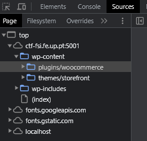
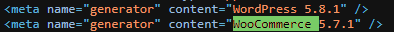
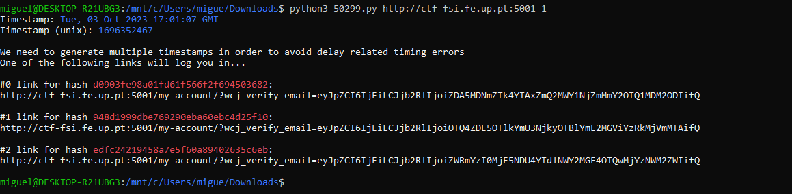
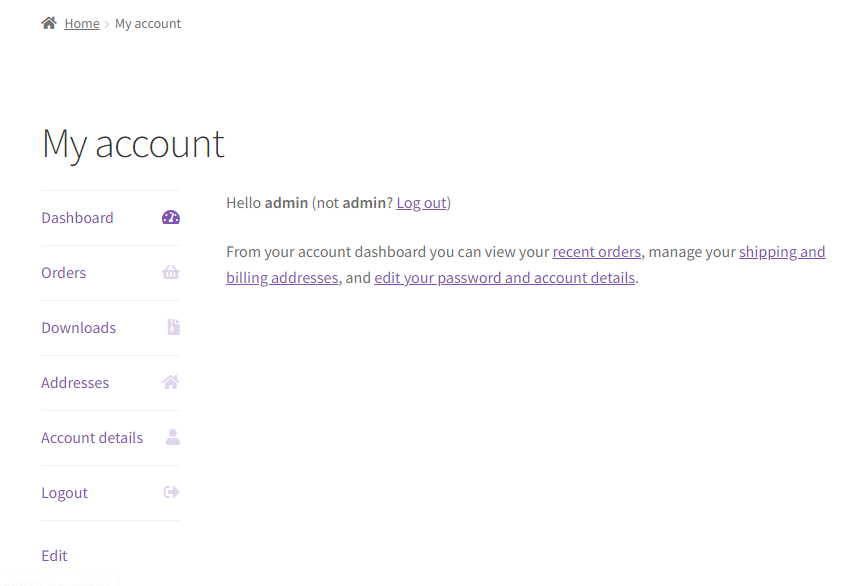

# CTF 1 - Semana 3

## Primeira parte
Acedemos à página **http://ctf-fsi.fe.up.pt:5001/**, que é um servidor WordPress, na recolha de informação começamos por analisar as "sources"  da página, onde rapidamente descobrimos que usava o plugin Woocommerce.

De seguida analisamos o código fonte que ao procurar com ctrl+f por Woocommerce encontramos a versão deste e também do WordPress:

Analisando a página apenas descobrimos 2 utilizadores : admin e Orval Sanford.
Com esta informação começamos a pesquisa pela CVE correta, encontramos a CVE-2021-34646 que permitia fazer login como outro utilizador e assim ultrapassamos o 1º desafio.

## Segunda parte
Na segunda parte, começamos por procurar um exploit e encontramos este aqui: **https://www.exploit-db.com/exploits/50299** ,em que seguindo o primeiro passo procuramos no browser: **http://ctf-fsi.fe.up.pt:5001/wp-json/wp/v2/users/** e conseguimos verificar que o admin tem id=1.
No segundo passo, executamos um script de python que estava disponivel para download que usava esse id para atacar o site:

Obtivemos 3 links de validação de login e ao aceder a um destes links permitiu-nos fazer login como admin:

Por ultimo acedemos á página: **http://ctf-fsi.fe.up.pt:5001/wp-admin/edit.php** que no post privado estava escrita a flag do desafio: flag{please don't bother me}

