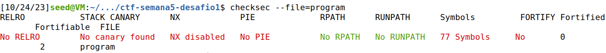
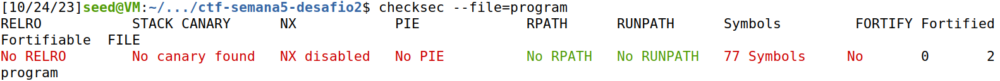
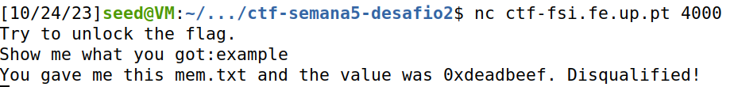
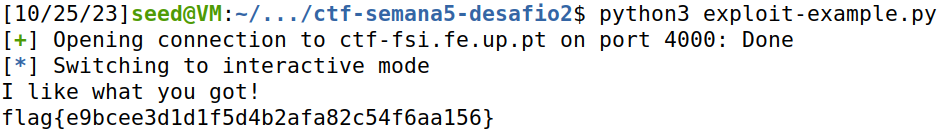

# CTF 3 - Semana 5
## Desafio 1
Começamos por explorar os ficheiros que estão na plataforma ctf-fsi que estão a ser executados na porta 4003 e utilizamos o comando checksec no program (main.c já compilado).



Vemos que o programa não está randomizado e não tem proteçoes , de stack canary nem de execuçao a nivel da stack.

De seguida analisamos o main.c e reparamos que meme_file ocupa 8 bytes e o buffer ocupa 32 bytes.

```shell
char meme_file[8] = "mem.txt\0";
char buffer[32];

scanf("%40s", &buffer);
```

Verificamos que o scanf usado no programa lê até 40 bytes para o buffer(que apenas contem 32 bytes), ou seja quando o input é superior a 32 bytes vai ocorrer um buffer overflow.

A memoria é alocada na stack contínuamente e depende da ordem que se declara as variáveis, ou seja se excedermos a capacidade do buffer ,ocorrendo um buffer overflow estamos a reescrever a zona da memória pertencente a meme_file , como em main.c mostra o conteudo de meme_file , nós queremos alterar meme_file para flag.txt .

Apenas alteramos o programa python na zona em que injetamos conteúdo para o servidor escrevendo 32 carateres concatenado com flag.txt e abrimos o servidor :

```shell
r.sendline(b"xxxxxxxxxxxxxxxxxxxxxxxxxxxxxxxxflag.txt")
```


## Desafio 2

Assim como no primeiro desafio começamos por explorar os ficheiros que estão na plataforma ctf-fsi que estão a ser executados na porta 4000 e utilizamos o comando checksec no program (main.c já compilado).



Vemos que o programa não está randomizado e não tem proteçoes , de stack canary nem de execuçao a nivel da stack.

De seguida analisamos o main.c e reparamos que **meme_file** ocupa 9 bytes, 4 bytes para um valor **val** e o **buffer** ocupa 32 bytes.

```shell
char meme_file[9] = "mem.txt\0\0";
char val[4] = "\xef\xbe\xad\xde";
char buffer[32];

scanf("%45s", &buffer);
```

Verificamos que a técnica a usar é semelhante ao desafio anterior, no entanto o conteúdo do ficheiro só era mostrado quando o valor em **val** fosse 0xfefc2324.

O resultado inicial do programa permanece constante e corresponde ao valor inicial da variável **val** declarada.



Com base nessa informação, conseguimos reconstruir os bytes necessários para que **val** seja igual a 0xfefc2324.

```
"\xef\xbe\xad\xde" > 0xdeadbeef
0xfefc2324 > "\x24\x23\xfc\xfe"
```

No programa python disponibilizado, na zona em que injetamos o conteúdo para o servidor, bastou escrever 33 caracteres seguidos do novo valor de val e nome do ficheiro que queremos ler.

```shell
r.sendline(b"xxxxxxxxxxxxxxxxxxxxxxxxxxxxxxxx\x24\x23\xfc\xfeflag.txt")
```


