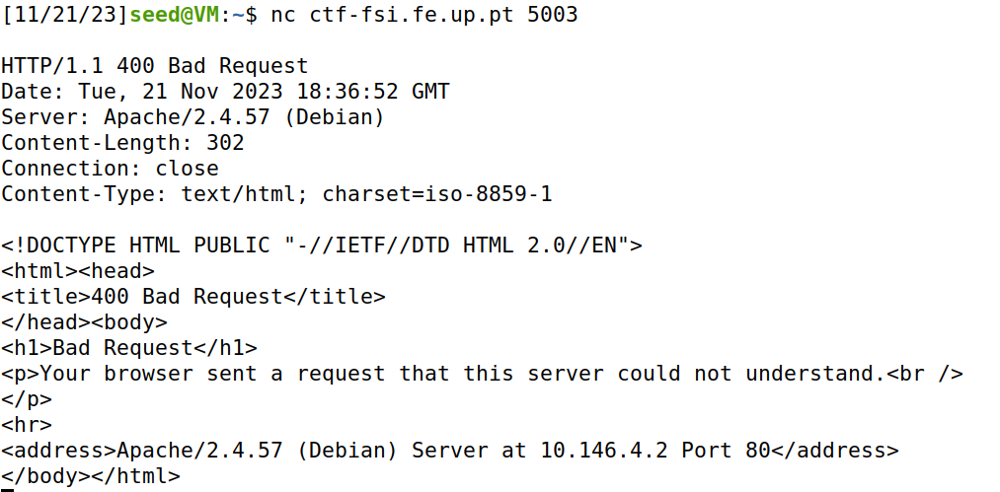
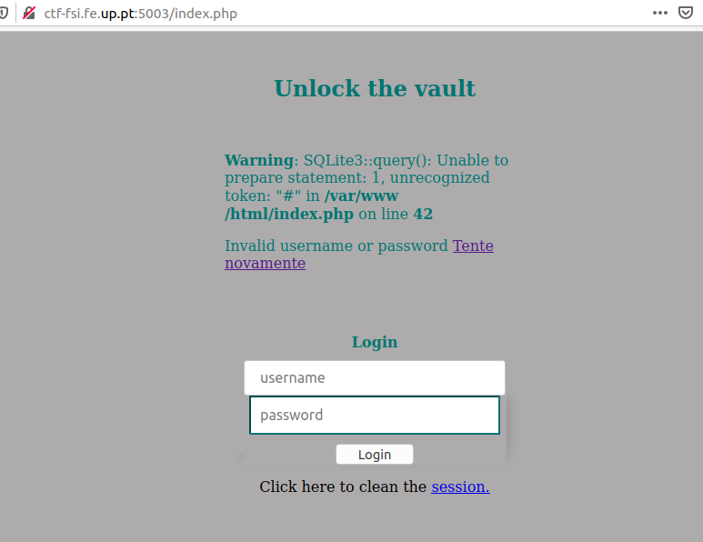
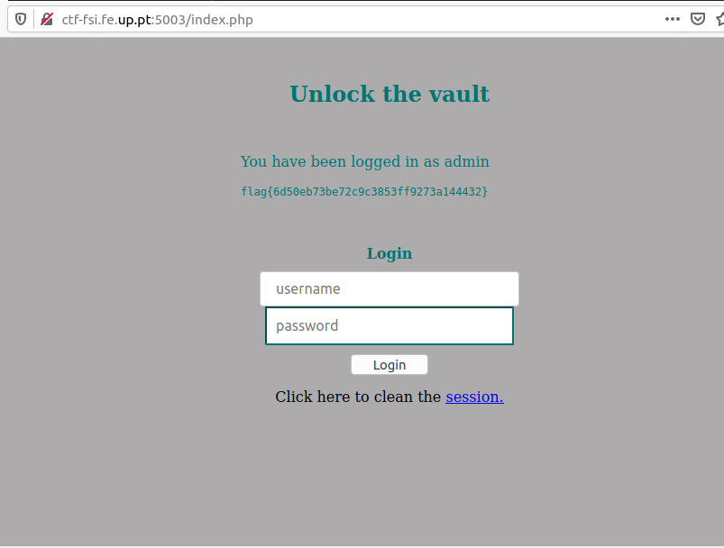

## CTF  Semana 8(Sql Injection)

# Ligaçao ao port 5003
Começamos por tentar entrar na porta 5003 usando o nc ctf-fsi.fe.up.pt 5003 mas não conseguimos entrar :




Entao entramos no website usando ctf-fsi.fe.up.pt:5003 

Devido ao logbook relacionado com Sql Injection Attack que tinha a seguinte query:

```sql
WHERE name= '$input_uname' and Password='$hashed_pwd'
```

Começamos por tentar admin'# como input para o username e qualquer coisa para a password, porque esta ao ser comentada , não vai interessar para a query que faz a verificação do site 

Tivemos o seguinte output:



E depois de uma breve pesquisa vimos que no sqlite3 os comentários são feitos usando -- em vez de # , então tentamos admin'-- como input do username.


E obtemos a nossa flag:



Como não há sanitização do input do user,conseguimos facilmente usurpar o controlo da query que em vez de proseguir como devia , apenas verifica o username 

```sql
WHERE name= '$input_uname'-- and Password='$hashed_pwd'
```
