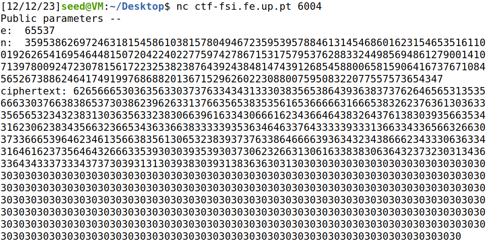
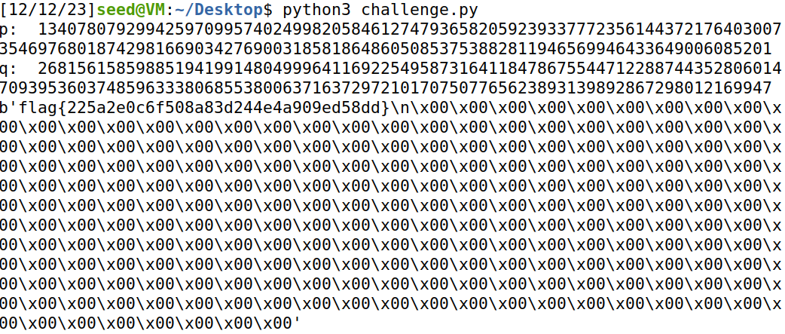

## Semana 11 (RSA)

Inicialmente exploramos o ficheiro disponibilizado na plataforma CTF. Trata-se de um template para o encode e decode de mensagens com criptografia RSA:

```py
def enc(x, e, n):
    int_x = int.from_bytes(x, "little")
    y = pow(int_x,e,n)
    return hexlify(y.to_bytes(256, 'little'))

def dec(y, d, n):
    int_y = int.from_bytes(unhexlify(y), "little")
    x = pow(int_y,d,n)
    return x.to_bytes(256, 'little')
```

No servidor dos CTFs, na porta 6004, foi possível observar a seguinte mensagem:



Para verificar se `p` e `q` são primos implementamos a função testPrime(n):
```py
ef testPrime(n):
    if n == 2 or n == 3:
        return True

    if n <= 1 or n % 2 == 0:
        return False

    r, d = 0, n - 1
    while d % 2 == 0:
        r += 1
        d //= 2

    for _ in range(5):
        a = random.randrange(2, n - 1)
        x = pow(a, d, n)
        if x == 1 or x == n - 1:
            continue
        for _ in range(r - 1):
            x = pow(x, 2, n)
            if x == n - 1:
                break
        else:
            return False
    return True
```

Agora temos de encontrar `e` e `d` tal que ed % (p-1)(q-1) = 1, que vão ser usados para chave pública e secreta. 
O `e` ja é conhecido `e=65537` e para descobrir o `d` 
```py 
d = pow(65537, -1, ((p-1)*(q-1)))
```

Depois de descobrimos tudo corremos o ficheiro `challenge.py` e obtivemos a flag.


