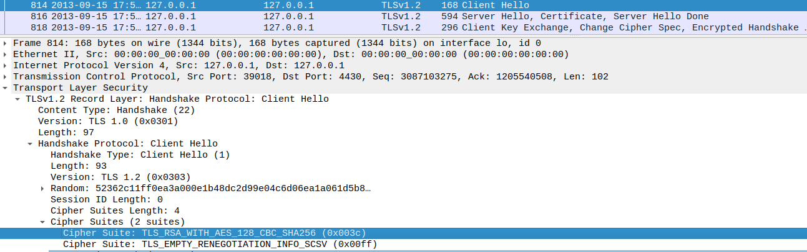

## CTF Semana 13 - Find-my-TLS

Começamos por analisar o ficheiro `dump.pcapng` na aplicação `Wireshark`. 


Como diz no enunciado a flag pedida esta na estrutura seguinte:
```
flag{<frame_start>-<frame_end>-<selected_cipher_suite>-<total_encrypted_appdata_exchanged>-<size_of_encrypted_message>}
```
onde:
- <frame_start> e <frame_end> são o primeiro e último (respetivamente) números de frame correspondentes ao procedimento de handshake do TLS.
- <selected_cipher_suite> é a ciphersuite escolhida para a conexão TLS (o nome, não o código)
- <total_encrypted_appdata_exchanged> é a soma total do tamanho dos dados cifrados trocados neste canal, até à sua terminação.
- <size_of_encrypted_message> é o tamanho da mensagem cifrada no handshake que concluí o procedimento de handshake.


```
<frame_start> = 814
```


```
<frame_end> = 819
```


```
<selected_cipher_suite> = TLS_RSA_WITH_AES_128_CBC_SHA256
```



```
<total_encrypted_appdata_exchanged> = 80 + 1184 = 1264
```


```
<size_of_encrypted_message> = 80
```


O que resulta na ```flag{814-819-TLS_RSA_WITH_AES_128_CBC_SHA256-1264-80}```.
