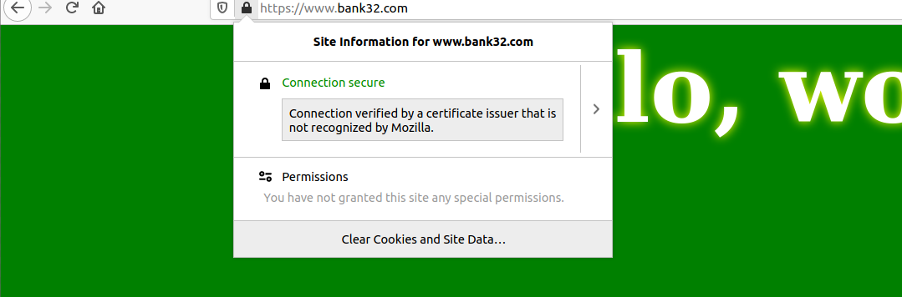
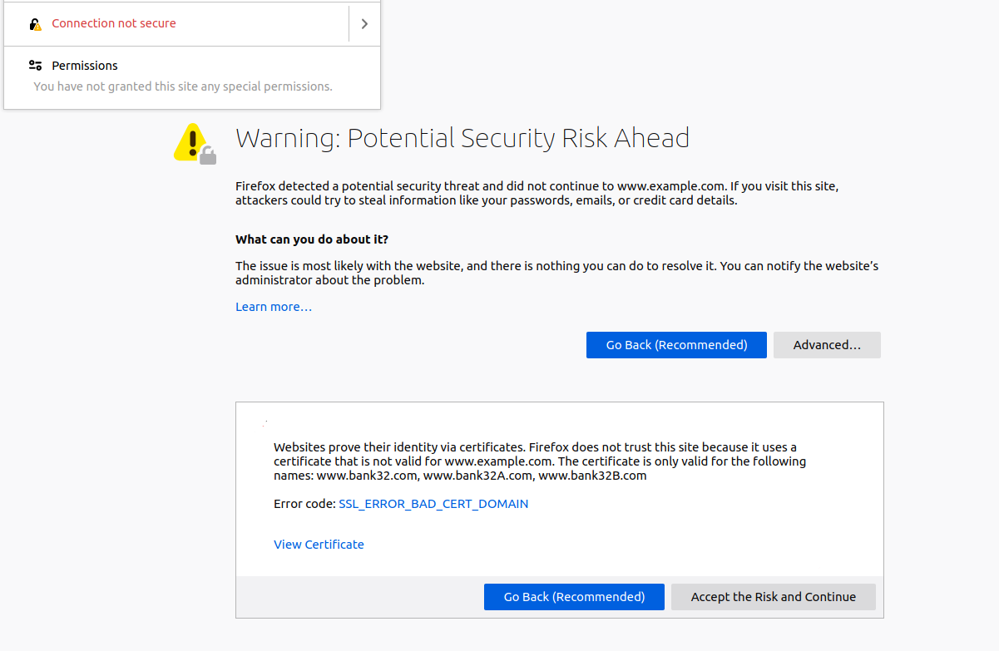

# Public-Key Infrastructure

## Setup

Incialmente adicionamos nos hosts conhecidos pela máquina virtual novas entradas e executamos o container do lab:

```bash
sudo nano etc/hosts     # colocar '10.9.0.80 www.bank32.com'

$ dcbuild               # docker-compose build
$ dcup                  # docker-compose up
```

## Task 1 -  Becoming a Certificate Authority (CA)

Copiamos o certificado que estava em `/usr/lib/ssl/openssl.cnf` para a nossa pasta de trabalho local, comentando a linha "unique_subject" e fizemos os seguintes comandos de modo a criar o ambiente da nossa própria autoridade de certificação: 

```bash
mkdir demoCA 
cd ./demoCA
mkdir certs crl newcerts
touch index.txt
echo "1000" >> serial
```

Depois fizemos setup da CA com o seguinte comando:

```bash
openssl req -x509 -newkey rsa:4096 -sha256 -days 3650 -keyout ca.key -out ca.crt
```

Durante o processo colocamos os seguintes dados:


Depois descodificamos o certificado X509 e a chave RSA de modo a ver os seus conteudos:

```bash
openssl x509 -in ca.crt -text -noout
openssl rsa -in ca.key -text -noout
```

Podemos ver que é um certificado CA uma vez que existe na secção *basic constraints* um atributo *CA* que neste caso é verdadeiro:


Percebemos que o certificado era *self-signed* pois os campos *issuer* e *subject* sao iguais:


## Task 2 - Generating a Certificate Request for Your Web Server

Com o seguinte comando criamos o certificado para o site `www.bank32.com`:

```bash
openssl req -newkey rsa:2048 -sha256 -keyout server.key -out server.csr -subj "/CN=www.bank32.com/O=Bank32 Inc./C=US"  -passout pass:1234 -addext "subjectAltName = DNS:www.bank32.com, DNS:www.bank32A.com, DNS:www.bank32B.com"
```

Com isto obtivemos dois ficheiros: o RSA do site e o Certificado do site.

## Task 3 - Generating a Certificate for your server

Para gerar um certificado para o nosso próprio servidor www.bank32.com, foi necessário correr o seguinte comando:

```bash
openssl ca -config myCA_openssl.cnf -policy policy_anything -md sha256 -days 3650 -in server.csr -out server.crt -batch -cert ca.crt -keyfile ca.key
```

Com isto obtivemos o ficheiro: `server.crt`. Podemos aqui verificar que de facto o certificado abrange os nomes colocados na tarefa 2:
- www.bank32.com
- www.bank32A.com
- www.bank32A.com


Para verificar isto tinhamos de descomentar a linha copy_extensions = copy" do ficheiro "myCA_openssl.cnf".


## Task 4 - Deploying Certificate in an Apache-Based HTTPS Website

Copiamos os ficheiros "server.csr", "server.key" e "server.crt" para a pasta partilhada `/volumes` e mudamos os nomes para bank32. Alteramos o ficheiro "etc/apache2/sites-available/bank32_apache_ssl.conf" dentro do container, para que o certificado e chave usadas fossem iguais aos da pasta partilhada:

```bash
<VirtualHost *:443> 
    DocumentRoot /var/www/bank32
    ServerName www.bank32.com
    ServerAlias www.bank32A.com
    ServerAlias www.bank32B.com
    ServerAlias www.bank32W.com
    DirectoryIndex index.html
    SSLEngine On 
    SSLCertificateFile /volumes/bank32.crt
    SSLCertificateKeyFile /volumes/bank32.key
</VirtualHost>
```

Para iniciar o servidor Apache abrimos uma shell no container utilizando os comandos dockps e docksh e inserimos o seguinte comando:

```bash
 service apache2 start
```


Acedemos ao *site* `https://bank32.com`, mas verificamos que a ligação era insegura :


Para tornar a nossa ligação segura, adicionamos o certificado CA que geramos às autoridades no browser, em `about:preferences#privacy` -> Certificates -> View Certificates -> Authorities -> Import, e verificamos que a ligação passou a ser segura: 



## Task 5 - Launching a Man-In-The-Middle Attack

A configuração do servidor foi alterada para apresentar o site `www.example.com` com as configurações anteriores. O ficheiro "etc/apache2/sites-available/bank32_apache_ssl.conf" ficou assim:


Alteramos também o DNS da vítima, ligando o *hostname* `www.example.com` ao IP do webserver malicioso:

```bash
sudo nano etc/hosts     # colocar '10.9.0.80 www.example.com'
```

Ao dar rebuild ao servidor e acedendo ao site `www.example.com` verificamos que o browser alerta para um potencial risco:




Isto deve-se à incoerência do certificado usado, porque o nome de dominio não coincide com aquele presente no certificado do servidor. 

## Task 6 - Launching a Man-In-The-Middle Attack with a Compromised CA

Admitindo que o nosso CA está comprometido, pode ser usado para criar certificados para sites maliciosos. No caso, queremos criar um certificado para o site `www.example.com`, por isso repetimos os comandos da Tarefa 2:

```bash
openssl req -newkey rsa:2048 -sha256 -keyout example.key -out example.csr -subj "/CN=www.example.com/O=example Inc./C=US" -passout pass:1234
openssl ca -config myCA_openssl.cnf -policy policy_anything -md sha256 -days 3650 -in example.csr -out example.crt -batch -cert ca.crt -keyfile ca.key
```

Depois modificamos o ficheiro de configuração do servidor `etc/apache2/sites-available/bank32_apache_ssl.conf` para utilizar os dois ficheiros originados: **example.csr** e **example.key**:


Ao reiniciar o servidor e aceder ao site `www.example.com` verificamos que a ligação já era segura. 


